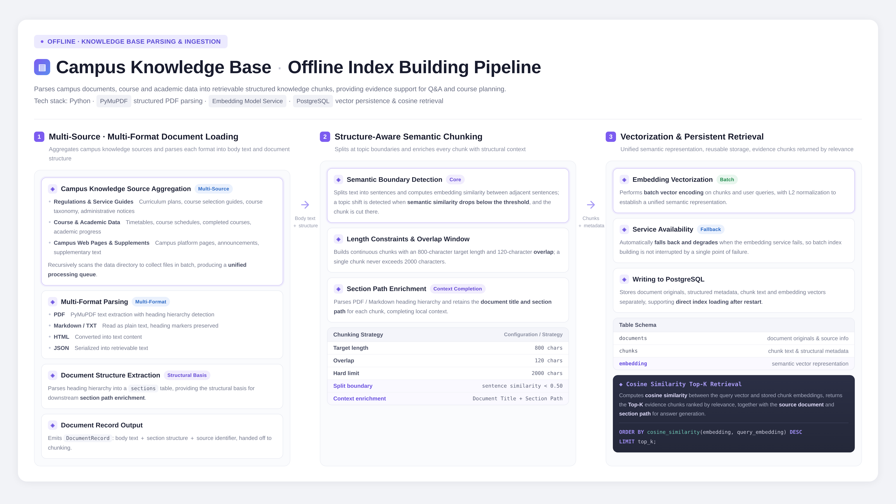
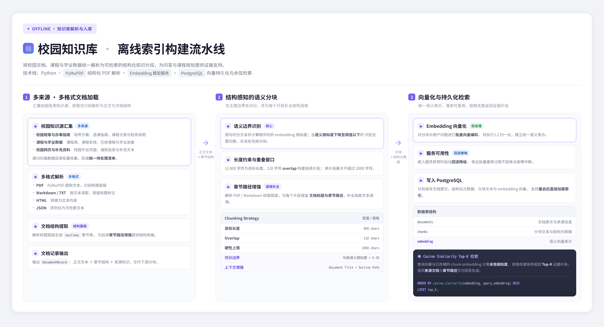

# System Logic Showcase

This page presents the high-level logic behind the Smart Campus Assistant's Retrieval-Augmented Generation (RAG) capability and course-selection assistant.

## RAG Pipeline

The RAG pipeline prepares campus policies, academic regulations, course information, and other trusted documents for question answering. It loads and parses source files, splits them into retrieval-friendly chunks, converts the chunks into vector embeddings, and stores them in a FAISS vector index. When a student asks a question, the system retrieves the most relevant evidence and supplies it to the large language model so that answers are grounded in the knowledge base and can expose their sources.

## Course Selection Assistant

The course-selection assistant combines a student's completed courses and current timetable with degree requirements, available course data, and the course knowledge base. It retrieves relevant program rules and candidate courses, then uses LLM reasoning to formulate a personalized semester plan. The result includes recommended courses, courses that may be deferred, credit checks, and a graduation-progress summary, helping students make choices that are both practical and aligned with their degree plan.

## RAG 离线处理流程

该流程将校园政策、培养方案、课程资料等可信文档转化为可检索的知识库：系统先加载并解析原始文件，再按合适粒度切分文本，生成向量嵌入并写入 FAISS 向量索引。当用户提出问题时，系统检索最相关的证据片段，并将其与问题一同提供给大语言模型，从而生成有知识依据、可追溯来源的回答。

## 选课助手逻辑

选课助手综合学生已修课程、当前课表、培养方案、可选课程数据和课程知识库。系统先检索与专业要求和候选课程相关的信息，再通过 LLM 推理生成个性化的学期选课计划；最后完成学分核算与毕业要求检查，并输出推荐课程、可延期课程以及毕业进度摘要。
