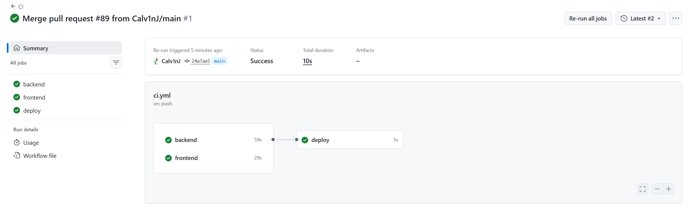
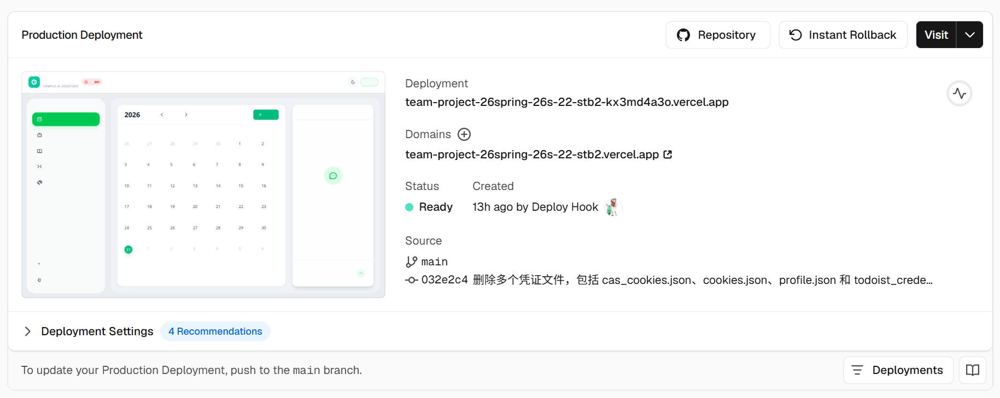

# 团队报告 — 项目指标

> 使用工具：`pygount`（代码行数统计）、`radon`（圈复杂度分析）
> 项目：智能校园助手系统（Smart Campus Assistant System）

---

## 1. 指标（Metrics）

### 1.1 代码行数（Lines of Code）

| 语言     | 文件 |   占比 |  代码行 |  注释行 |
|----------|:---:|-------:|--------:|--------:|
| Python   | 160 | 83.8%  | 15,191  |  4,011  |
| TSX      |  10 |  5.2%  |  4,187  |    146  |
| TS       |   1 |  0.5%  |    438  |     13  |
| CSS      |   2 |  1.0%  |    212  |      2  |
| 其他     |  18 |  9.4%  |      3  |    168  |
| **合计** |**191**| 100% |**20,031**|**4,340**|

- **总代码行数：20,031**（不含空行和注释行）
- **总注释行数：4,340**（注释率：17.8%）
- Python 是主力语言，占全部代码的 75.9%

### 1.2 源文件数量（Number of Source Files）

| 类别 | 数量 |
|------|:----:|
| Python（`backend/src/`） | ~95 |
| Python（`backend/tests/`） | ~47 |
| Python（`backend/scripts/`） | ~18 |
| TypeScript/TSX（`frontend/src/`） | 11 |
| CSS（`frontend/src/`） | 2 |
| **源文件合计** | **191** |

> **说明**：「源文件」涵盖所有非生成、非第三方代码的文件。191 个文件中有 173 个是代码文件（Python、TSX、TS、CSS），其余为 Markdown、JSON 配置和 XML 文件。

### 1.3 圈复杂度（Cyclomatic Complexity）

**总体平均值：A（3.98）**

基于 radon 的 McCabe 复杂度评级标准：

| 评级 | 数值范围 | 函数占比 |
|:----:|:--------:|:--------:|
| A    | 1–5      | ~92%     |
| B    | 6–10     | ~6%      |
| C    | 11–20    | ~1.5%    |
| D    | 21–30    | <0.3%    |
| E    | 31–40    | <0.3%    |
| F    | 41+      | 0%       |

**复杂度最高的 5 个函数：**

| 排名 | 函数名 | 所在文件 | 复杂度 |
|:----:|--------|----------|:------:|
| 1 | `AgentRunner.run_turn_stream` | `agents/agent_runner.py:51` | E（39） |
| 2 | `crawl_site` | `ingestion/sustech_doc_crawler.py:305` | D（22） |
| 3 | `ObjectStore._validate_against_annotation` | `core/object_store.py:80` | C（19） |
| 4 | `get_script_chat_history` | `api/routes/script_automation.py:88` | C（14） |
| 5 | `_build_schedule_text` | `ingestion/index_course_knowledge_base.py:153` | C（11） |

> `run_turn_stream`（E/39）是 Agent 对话的核心流式事件循环，其高复杂度源于 LangChain 事件的多路复用处理。建议后续重构为更细粒度的事件处理子方法。

### 1.4 依赖数量（Number of Dependencies）

| 来源 | 运行时依赖 | 开发依赖 | 合计 |
|------|:---------:|:--------:|:----:|
| Python（`pyproject.toml`） | 26 | 1（pytest） | 27 |
| 前端（`package.json`） | 7 | 15 | 22 |
| **合计** | **33** | **16** | **49** |

**主要 Python 运行时依赖**：`langchain`、`langchain-openai`、`fastapi`、`uvicorn`、`pydantic`、`openai`、`faiss-cpu`、`PyMuPDF`、`playwright`、`pandas`、`numpy`

**主要前端依赖**：`react`、`react-dom`、`tailwindcss`、`vite`、`typescript`、`react-markdown`、`react-syntax-highlighter`

---

## 2. CI/CD 流水线（Pipeline）

### 2.1 流水线概述

项目采用 **GitHub Actions** 作为 CI/CD 平台，实现代码推送/拉取请求时的自动检查与部署。流水线包含三个作业（jobs）：

| 阶段 | 作业名称 | 触发条件 | 目标 |
|:----:|----------|----------|------|
| CI | `backend` | push / PR → main | 运行后端 Python 测试 |
| CI | `frontend` | push / PR → main | 编译前端 TypeScript 项目 |
| CD | `deploy` | push → main（且 CI 通过） | 自动部署前端到 Vercel、后端到 Render |

### 2.2 CI — 后端测试（`backend`）

- **运行环境**：`ubuntu-latest`，Python 3.11（通过 Conda 管理）
- **使用的工具/框架**：`conda-incubator/setup-miniconda`（Conda 环境）、`pip`（安装依赖）、`pytest`（测试框架）
- **步骤**：
  1. `actions/checkout@v4` — 拉取代码
  2. `conda-incubator/setup-miniconda` — 配置 Conda 并创建 Python 3.11 环境
  3. `pip install -r requirements.txt` + `pip install pytest` — 安装项目依赖与测试工具
  4. `pytest -v`（忽略需要 Playwright / Todoist / API Key 等特殊依赖的测试文件）— 运行约 140 个测试用例
- **测试覆盖范围**：排除了 13 个依赖特殊环境（Playwright 浏览器、Todoist 凭据、LLM API Key、黑板爬虫等）的测试文件，其余核心日历逻辑测试正常执行。
- **结果证明**：流水线执行成功后，`pytest` 返回 `passed` 状态码，所有运行的测试用例通过（见下方 2.6 节截图）。

### 2.3 CI — 前端构建（`frontend`）

- **运行环境**：`ubuntu-latest`，Node.js 20
- **使用的工具/框架**：`actions/setup-node`（Node.js 环境）、`npm`（包管理）、`Vite`（构建工具）、`TypeScript`（类型检查）
- **步骤**：
  1. `actions/checkout@v4` — 拉取代码
  2. `actions/setup-node@v4`（含 npm 缓存）— 配置 Node.js 20
  3. `npm ci` — 安装依赖（锁定版本）
  4. `npm run build` — 执行 TypeScript 类型检查（`tsc -b`）与 Vite 生产构建
- **结果证明**：构建成功后输出 `dist/` 目录，TypeScript 编译无错误。

### 2.4 CD — 自动部署（`deploy`）

- **触发条件**：仅当 `push` 到 `main` 分支，且 `backend` 与 `frontend` 两个 CI 作业全部通过后执行。
- **使用的平台**：
  | 平台 | 部署目标 | 技术栈 |
  |------|----------|--------|
  | **Vercel** | 前端静态站点 | Vite + React + TypeScript，通过 `vercel.json` 配置框架选项 |
  | **Render** | 后端 Web 服务 | FastAPI + Uvicorn，通过 `render.yaml` 配置 Python 3.11 运行时 |
- **部署方式**：通过 GitHub Actions 调用平台的 **Deploy Hook**（Webhook URL），触发平台从 GitHub 仓库拉取最新代码并自动构建/启动。
- **跨域通信**：前端通过环境变量 `VITE_API_URL` 指向 Render 后端地址，Vite 在构建时将变量内联到静态文件中。

### 2.5 流水线配置访问

- **GitHub Actions 工作流文件**：[`.github/workflows/ci.yml`](.github/workflows/ci.yml)
- **Render 平台配置**：[`render.yaml`](render.yaml)（Infrastructure as Code）
- **Vercel 平台配置**：[`frontend/vercel.json`](frontend/vercel.json)
- **后端依赖清单**：[`backend/requirements.txt`](backend/requirements.txt)
- **前端依赖清单**：[`frontend/package.json`](frontend/package.json)

### 2.6 执行截图

> *以下为 CI/CD 流水线成功执行的截图：*

#### 2.6.1 GitHub Actions — CI 全部通过

---

## 汇总

| 指标 | 数值 | 工具 |
|------|------|------|
| 代码行数 | **20,031** | pygount |
| 源文件数量 | **191** | pygount |
| 圈复杂度（均值） | **A（3.98）** | radon |
| 依赖数量 | **49**（33 运行时 + 16 开发） | 手动统计 |
